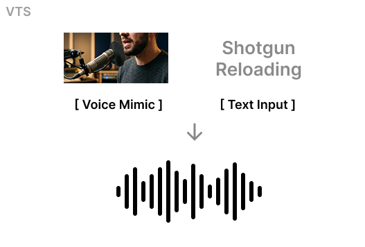

# VTS (Voice To Sound)

`Describing a sound with text is hard.` You can hear it in your head immediately, but the moment you try to write it down, it usually turns into vague words or bad beatboxing.

VTS lets you do the obvious thing instead: sketch the sound with your voice, add a short text prompt, and generate a sound effect from both.



Generate sound effects from:

- a short voice sketch
- a text prompt

If you have ever typed "metallic sci-fi impact with a short tail" and then immediately made a much more useful `pshh-kting` sound with your mouth, this repo is for you.

## Demo

_[Demo link](https://spicy-pufferfish-699.notion.site/VTS-347cf95761f480f19dc0eb790e1467af?source=copy_link)_

## Checkpoints

Pretrained checkpoints are available on Hugging Face:

- [https://huggingface.co/Daniel777/VTS](https://huggingface.co/Daniel777/VTS)

Download:

```bash
pip install -U "huggingface_hub"
hf download Daniel777/VTS model_voice_1030_24.pth vae_weight.pth --local-dir ./checkpoints
```

## 🌟 Why This Exists

**Describing sound with text alone is surprisingly hard.**

Try picking a sound in your head (e.g., Minecraft chest opening or Creeper exploding). **Can you describe the sound directly as text?** At best, you can only describe the situation.

That is why sound-design meetings often turn into a brief beatboxing session. When words stop being precise enough, people make the sound with their mouths.

VTS turns that behavior into a new interface. **Instead of relying on text alone, you can give the model a short vocal sketch together with a text prompt.**

`The voice carries timing, contour, and feel; the text keeps the generation anchored to intent.`

This package isolates the older `voice_cond` path from the original workspace and repackages it as a small, reusable project.

## Installation

Create a fresh environment first. Install the correct PyTorch build for your CUDA version before installing the package.

```bash
python3 -m venv .venv
source .venv/bin/activate
pip install --upgrade pip
```

Example for CUDA 12.1:

```bash
pip install torch torchaudio --index-url https://download.pytorch.org/whl/cu121
```

Then install this package:

```bash
pip install -e .
```

If `k-diffusion` does not install cleanly through `pyproject.toml`, install it directly:

```bash
pip install git+https://github.com/crowsonkb/k-diffusion.git
```

## Quick Start

### Inference

You need:

- a trained diffusion checkpoint
- a VAE checkpoint
- a prompt audio clip for voice conditioning
- a text prompt

```bash
python3 scripts/infer.py \
  --model-ckpt ./checkpoints/model_voice_1030_24.pth \
  --ae-ckpt ./checkpoints/vae_weight.pth \
  --prompt-audio /data/prompt.wav \
  --text "glassy swipe with rising pitch" \
  --output /tmp/generated.wav \
  --duration 3.0 \
  --steps 100 \
  --cfg-scale 6.0 \
  --device cuda
```

### Training

You need:

- a training manifest
- optionally a validation manifest
- a VAE checkpoint

```bash
python3 scripts/train.py \
  --train-manifest /data/train.csv \
  --valid-manifest /data/valid.csv \
  --ae-ckpt ./checkpoints/vae_weight.pth \
  --output-dir /checkpoints/voice_text_sfx_run1 \
  --batch-size 4 \
  --num-epochs 20 \
  --device cuda
```

## Dataset Format

Training uses a manifest file in CSV or JSONL format.

Required fields:

- `audio_path`: path to the target audio used for latent diffusion training
- `caption`: text prompt

Optional fields:

- `conditioning_audio_path`: separate reference audio for voice conditioning
- `seconds_start`: defaults to `0.0`
- `seconds_total`: defaults to the final loaded clip duration

If `conditioning_audio_path` is omitted, `audio_path` is reused as the conditioning source.

Example CSV:

```csv
audio_path,conditioning_audio_path,caption,seconds_start,seconds_total
/data/train/sample_0001.wav,/data/voice_refs/ref_0001.wav,"metal hit with airy whoosh",0.0,3.0
/data/train/sample_0002.wav,,"rubbery pop with short tail",0.0,3.0
```

## Inference Notes

- The current inference path uses the same `voice_cond` feature extractor as training.
- The prompt audio is converted into a conditioning tensor before sampling.
- Sampling uses DPM-Solver++(3M) SDE through `k-diffusion`.
- Typical values:
  - `steps=100`
  - `cfg_scale=6.0`
  - `duration=3.0`

## 🤝 Acknowledgements

- Thanks to [OptimizerAI](<[https://www.linkedin.com/company/optimizerai/](https://www.linkedin.com/company/optimizerai/)>). I worked on this project while I was at OptimizerAI.

## License

MIT License. See [LICENSE](./LICENSE).
